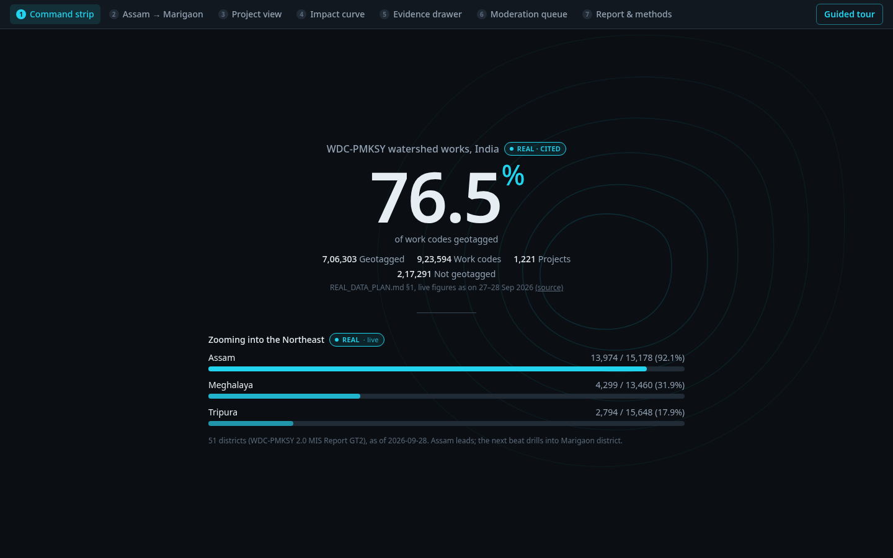
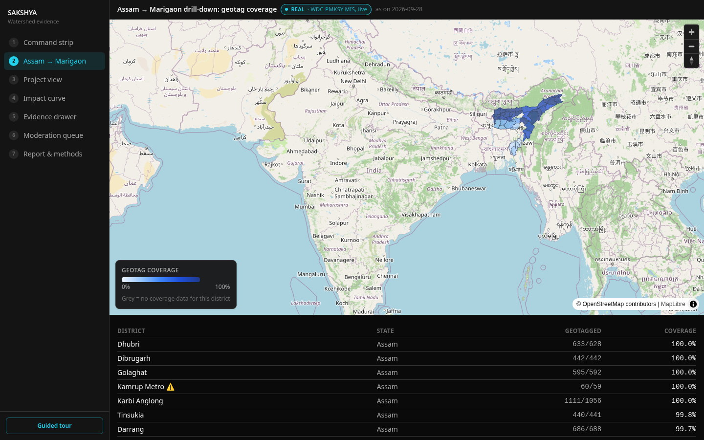
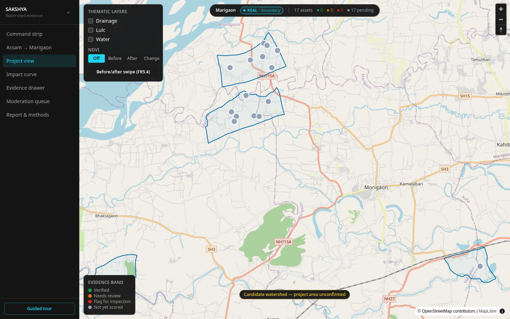
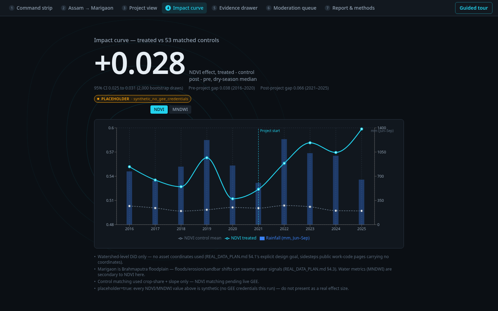
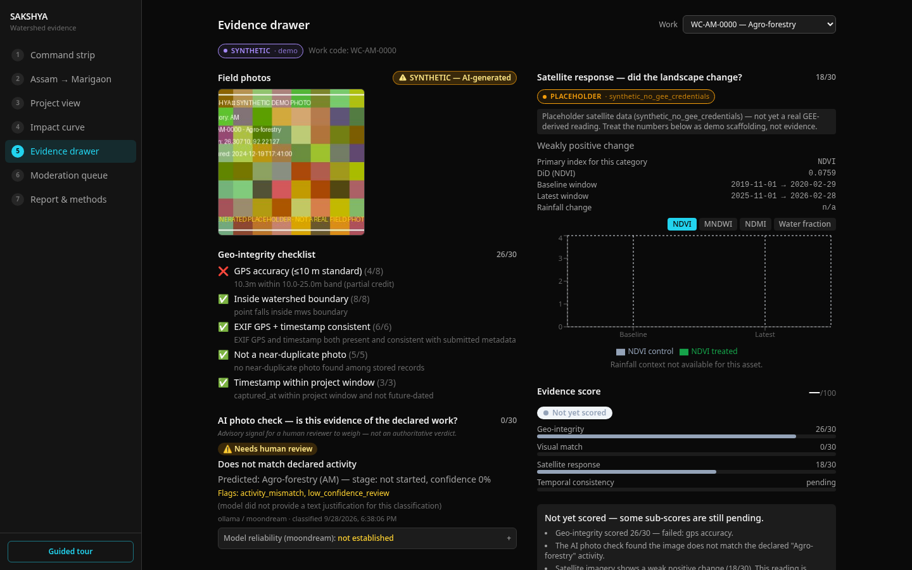
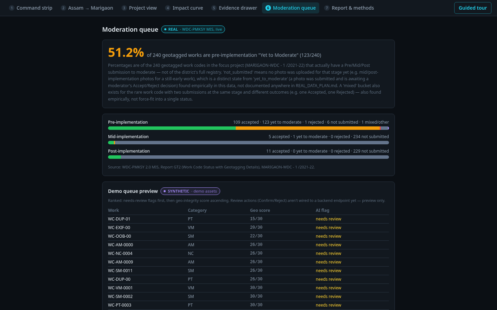
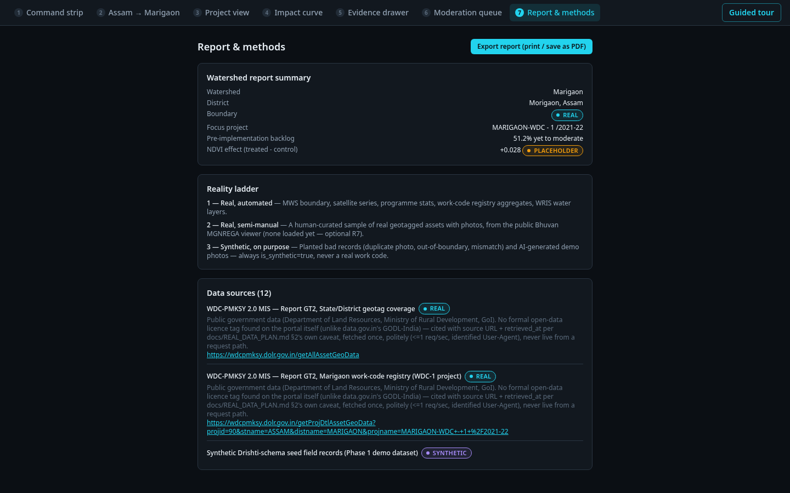

# SAKSHYA (साक्ष्य = "evidence")

**Smart India Hackathon 2026 · Problem Statement 26015 · Ministry of Rural Development, Dept. of Land Resources (DoLR)**

An analytics layer on top of SRISHTI–DRISHTI that fuses geo-tagged field
photos with 30 m satellite evidence to verify whether watershed
development works were actually built, and whether they're actually
working — surfaced as a per-asset **Evidence Score** and a per-watershed
**Outcome Index** on an interactive map dashboard.

> **Photo answers "was it built?" Satellite answers "did it work?" SAKSHYA fuses both.**



---

## Table of contents

- [The problem](#the-problem)
- [How it works](#how-it-works)
- [Evidence scoring, in full](#evidence-scoring-in-full)
- [Screenshots](#screenshots)
- [Architecture](#architecture)
- [Repo structure](#repo-structure)
- [Getting started (local dev)](#getting-started-local-dev)
- [Running the tests](#running-the-tests)
- [API surface](#api-surface)
- [Data integrity policy](#data-integrity-policy---read-this-before-touching-seed-data)
- [Deployment](#deployment)
- [Project status](#project-status)
- [Documentation index](#documentation-index)

---

## The problem

DRISHTI (NRSC/Bhuvan mobile app) captures geo-tagged, time-stamped field
photos of watershed assets nationally — 700,000+ geotagged work codes as
of the last public MIS pull. Today these photos are used only as
proof-of-upload; nobody analyses them. Separately, DoLR already has access
to 30 m satellite data via SRISHTI, but nothing fuses the two. There's no
standardized way to flag suspect, duplicate, or mislabeled evidence at the
scale of lakhs of photos, and no thematic visualization (drainage, land
cover, vegetation change) tied back to individual assets or
micro-watersheds.

SAKSHYA is the fusion layer: it ingests a field record, checks whether the
GPS/EXIF/timestamp evidence is internally consistent, asks a vision model
whether the photo actually shows the declared activity, measures the real
before/after satellite signal around that exact location versus a control
zone, and combines all three into one explainable, band-classified score —
without ever pretending to be more certain than the underlying evidence
supports.

Full problem statement, goals, and non-goals: [`docs/PRD.md`](docs/PRD.md) §2–4.

## How it works

```
Field photo + GPS/EXIF + declared activity
        │
        ▼
┌───────────────────┐     ┌──────────────────────┐     ┌────────────────────────┐
│  Geo-integrity     │     │  AI Image Interpreter │     │  Satellite Intelligence │
│  (in-process,      │     │  (vision LLM, strict  │     │  (Earth Engine,         │
│   Shapely)          │     │   enum-only schema)   │     │   precomputed offline)  │
│  — accuracy, in-    │     │  "is this photo       │     │  — NDVI/MNDWI           │
│  boundary, EXIF,    │     │  evidence of the      │     │  difference-in-         │
│  duplicate, sane    │     │  declared activity?"  │     │  differences vs. a      │
│  timestamp          │     │  never "did it work"  │     │  matched control zone   │
└─────────┬──────────┘     └───────────┬───────────┘     └────────────┬───────────┘
          │  max 30                    │  max 30                      │  max 30 (+10 temporal)
          └──────────────┬─────────────┴──────────────────┬───────────┘
                          ▼                                ▼
                 evidence_score (0–100)  →  verified (≥70) / review (40–69) / flag (<40)
```

The **visual match** score only ever answers "is this photo evidence of
the declared activity?" — it never judges whether the intervention
*worked*. That question belongs entirely to the **satellite response**
score. The two are deliberately kept from blending together anywhere in
the code or the UI copy.

## Evidence scoring, in full

Authoritative spec: [`docs/PRD.md`](docs/PRD.md) §12. Summarized here for
convenience — PRD.md wins on any discrepancy.

**Geo-integrity (max 30)** — `api/app/services/geo_integrity.py`, pure Shapely, no DB:

| Rule | Points |
|---|---|
| GPS accuracy | 8 (≤10 m) / 4 (10–25 m) / 0 (>25 m or missing) |
| Inside the micro-watershed boundary | 8 / 0 |
| EXIF present & consistent with submitted metadata | 6 / 3 / 0 |
| Not a near-duplicate (pHash) | 5 / 0 |
| Timestamp sane (in-window, not future-dated) | 3 / 0 |

**Visual match (max 30)** — vision model output, enum-only, never a guessed category:

| `matches_declared` | `confidence` | Points |
|---|---|---|
| yes | ≥ 0.75 | 30 |
| yes | 0.5–0.75 | 20 |
| uncertain | any | 10 (routes to review queue) |
| no | any | 0 (raises a flag) |

**Satellite response (max 30)** — difference-in-differences vs. a matched
control, direction expected per activity category (e.g. ponds/check-dams
→ water extent ↑; vegetative/agronomic → NDVI ↑). Categories with no
reliable satellite signal (livestock, livelihood, other) get an explicit
neutral 15/30 rather than false precision.

**Temporal consistency (max 10)** — logical stage progression across
multiple photos over time where available; neutral 5/10 for single-time-point
records (most of the seed data), documented as a known limitation rather
than hidden.

```
evidence_score = geo_score + visual_score + satellite_score + temporal_score   # 0–100
band = verified (≥70) | review (40–69) | flag (<40)
```

Activity category codes are fixed to the official Srishti–Drishti manual
— `AM`, `VM`, `SM`, `PT`, `NC`, `BN`, `LS`, `LH`, `OM` — never invented.

## Screenshots

The dashboard tells a 7-beat story, from national context down to a
single asset's evidence:

| | |
|---|---|
|  District drilldown |  Project view — real boundary + asset pins |
|  Satellite impact curve |  Per-asset evidence drawer |
|  Review/moderation queue |  Report & methods |

Every screenshot is captured live against the real backend — every REAL/
SYNTHETIC/PLACEHOLDER badge on screen is driven by an actual field on the
API response, never hand-set.

## Architecture

| Layer | Stack |
|---|---|
| **Backend** | FastAPI (Python 3.12), PyMongo, Pydantic v2 for every request/response boundary |
| **Database** | MongoDB — geometries as GeoJSON with `2dsphere` indexes; indexes created idempotently at API startup (no separate migration step) |
| **Satellite processing** | Google Earth Engine Python API + `geemap`, run **offline only** via `scripts/` — the live API and frontend never make a live GEE call, results are precomputed to files the API just reads |
| **Vision AI** | Local Ollama model (`moondream`) via a strict enum-only JSON schema — low confidence or a schema-validation failure always routes to human review, the model is never allowed to guess an out-of-vocabulary category |
| **Photo processing** | Pillow/piexif/exifread (EXIF), `imagehash` (perceptual hash for duplicate detection) |
| **Frontend** | React 19 + Vite + TypeScript (strict) + Tailwind 4, MapLibre GL JS, Recharts, TanStack Query, Zod-validated API responses |
| **Deploy** | Docker — either a single all-in-one container (mongod + api + nginx under `supervisord`, one exposed port) or a 3-container `docker-compose.yml`; GitHub Actions CI/CD builds and ships it automatically |

## Repo structure

```
/api          FastAPI app — routers, services, models, tests (131 pytest, pure-unit + Mongo-integration)
/web          React + Vite frontend
/scripts      Offline GEE precompute, seed data loaders, real-data sourcing (Reality Pass)
/deploy       Single-container Docker image (mongod + api + nginx under supervisord)
/docs         PRD, deployment runbook, data sourcing/provenance, classifier benchmark
/.github      CI/CD (test + lint + build + deploy)
docker-compose.yml   Alternative 3-container deploy shape (mongo / api / web as separate services)
```

## Getting started (local dev)

```bash
# 1. Local MongoDB
cd api
docker compose up -d          # mongod on localhost:27018, dbs: sakshya / sakshya_test

# 2. Python env
uv venv .venv --python 3.12
uv pip install --python .venv/bin/python -r requirements-dev.txt
cp ../.env.example .env       # edit if your ports/paths differ

# 3. Run the API
.venv/bin/python -m uvicorn app.main:app --reload --port 8000
# -> http://localhost:8000/docs (Swagger), http://localhost:8000/health

# 4. Frontend (separate terminal)
cd ../web
npm ci
cp .env.example .env          # VITE_API_MODE=mock works with zero backend; live points at :8000
npm run dev                   # -> http://localhost:5173

# 5. (Optional) seed a demo watershed + synthetic field records through the real API
python scripts/seed_data.py --regenerate --base-url http://localhost:8000
```

Full environment variable reference: [`.env.example`](.env.example) (API) and
[`web/.env.example`](web/.env.example) (frontend).

## Running the tests

```bash
cd api
.venv/bin/python -m pytest -v                 # 131 tests — pure geo_integrity unit tests need no DB,
                                               # everything else needs the container from step 1 above
.venv/bin/python -m black --check app tests
.venv/bin/python -m ruff check app tests
```

```bash
cd web
npm run lint
npx tsc -b && npm run build
```

All of the above run automatically on every push/PR via
[`.github/workflows/ci-cd.yml`](.github/workflows/ci-cd.yml).

## API surface

Selected endpoints (full interactive docs at `/docs` when the API is running):

| Endpoint | Purpose |
|---|---|
| `POST /records` | Ingest a field record (photo + GPS/EXIF + declared activity) — runs geo-integrity synchronously, returns the real `geo_flags`/`geo_score` |
| `POST /assets/{id}/classify` | Run the vision classifier against a stored asset's photo |
| `POST /assets/{id}/satellite` | Attach precomputed satellite results to an asset |
| `GET /mws` / `GET /mws/{id}` | Micro-watershed list / detail (boundary, provenance) |
| `GET /mws/{id}/assets` | GeoJSON FeatureCollection of every asset in a watershed |
| `GET /mws/{id}/thematic/{layer}` | Precomputed thematic layer manifest (`drainage`, `lulc`, `ndvi_before/after/change`, `water`) |
| `GET /mws/{id}/watershed-impact` | Watershed-level DiD summary + timeseries |
| `GET /districts/geotag-coverage` | Real WDC-PMKSY MIS geotagging coverage, national/state/district |
| `GET /programme/marigaon` | Real WDC-PMKSY work-code registry + moderation backlog for the demo district |
| `GET /classifier/benchmark` | Honest, ground-truth-measured vision classifier accuracy — never a fabricated percentage |
| `GET /provenance` | Per-dataset source/licence/retrieved-at, for every non-code-derived number shown anywhere in the UI |

## Data integrity policy — read this before touching seed data

This is a hackathon integrity requirement, not polish to skip if short on time:

- **`is_synthetic` is never optional.** Any record that isn't real field
  data gets `is_synthetic = true` at insert time, no exceptions, and the
  frontend badges it visibly everywhere it appears.
- **`photo_source` goes with it** whenever `is_synthetic = true`
  (`ai_generated` / `stock_cc` / `unknown`) — so it's always clear exactly
  how a given photo was produced.
- **Never a fabricated number.** Where real data isn't available, the UI
  shows a clearly-labeled placeholder or synthetic value — it does not
  silently invent a plausible-looking one. `GET /classifier/benchmark`,
  for instance, reports `accuracy_status: "not_established"` rather than a
  made-up percentage when the underlying measurement genuinely can't
  support one yet.
- **The demo watershed is config, not code** — never hardcoded into
  schema, seed scripts, or GEE scripts, so swapping it costs zero code
  changes (`scripts/config/watershed.yaml`).

Since the initial build, a "Reality Pass" (see
[`docs/REAL_DATA_PLAN.md`](docs/REAL_DATA_PLAN.md)) replaced most
placeholder data with real, sourced data where it's honestly obtainable in
the time available: a real SLUSI micro-watershed boundary, real WDC-PMKSY
work-code registry data, and a real-photo classifier accuracy benchmark —
while being explicit in the UI about exactly what's still real vs.
synthetic vs. placeholder, rather than blurring the line.

## Deployment

Two container shapes exist, both build-tested and verified end-to-end:

- **Single container** (`deploy/Dockerfile`) — mongod + api + nginx under
  `supervisord`, one exposed port. This is what CI/CD actually ships.
- **3-container `docker-compose.yml`** at the repo root — mongo / api /
  web as separate services behind nginx, for a more conventional
  multi-container deploy if that's ever preferred instead.

GitHub Actions (`.github/workflows/ci-cd.yml`) runs tests + lint on every
push/PR, and — once three deploy secrets are configured — automatically
builds, pushes to `ghcr.io`, and SSH-deploys the single-container image on
every push to `main`.

**Full step-by-step deployment runbook (AWS EC2 free tier, written for
someone with zero prior context on this project):
[`docs/DEPLOYMENT.md`](docs/DEPLOYMENT.md).**

## Project status

Built phase-by-phase per [`docs/PRD.md`](docs/PRD.md) §10 — schema/API
foundation, AI image interpreter, satellite intelligence, evidence
scoring engine, and the map dashboard are all built and real-data-backed;
a "Reality Pass" then replaced placeholder data with real sourced data
wherever honestly possible within the timeline. Containerization and
CI/CD are built and verified; cloud deployment is in progress. See
`docs/PRD.md` §10 and this repo's commit history for the exact current
state — that's more current than any status line duplicated here would
stay.

## Documentation index

| Doc | What's in it |
|---|---|
| [`docs/PRD.md`](docs/PRD.md) | Full spec — schema, API contract, phase-by-phase requirements, the scoring formula (source of truth) |
| [`docs/PLAYBOOK.md`](docs/PLAYBOOK.md) | Why this architecture, GEE code snippets, demo script, PPT structure, judge Q&A prep |
| [`docs/REAL_DATA_PLAN.md`](docs/REAL_DATA_PLAN.md) | The Reality Pass plan — replacing placeholder data with real sourced data, and the hard rules that governed it |
| [`docs/DATA_SOURCES.md`](docs/DATA_SOURCES.md) | Per-dataset provenance: source, licence, retrieved-at |
| [`docs/CLASSIFIER_BENCHMARK.md`](docs/CLASSIFIER_BENCHMARK.md) | How the vision classifier's real-photo accuracy benchmark works and what it currently shows |
| [`docs/DEPLOYMENT.md`](docs/DEPLOYMENT.md) | Full AWS EC2 deployment runbook |
| [`CLAUDE.md`](CLAUDE.md) | Operating instructions for AI-assisted development on this repo — phase discipline, tech stack, non-negotiables |
